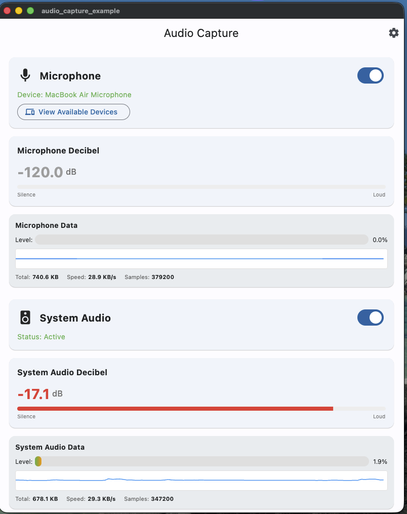
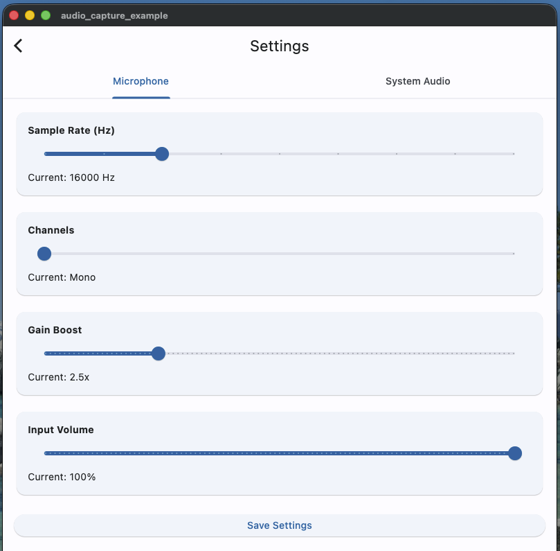
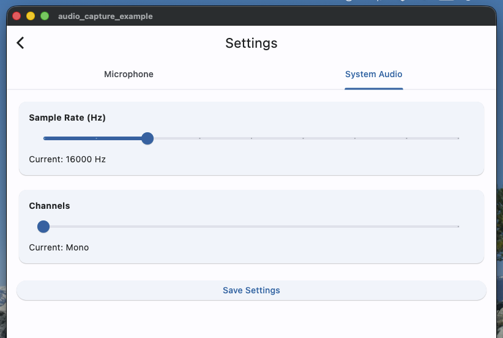

# desktop_audio_capture

A Flutter plugin for capturing audio on desktop platforms (macOS, Linux, Windows). Supports capturing from microphone and system audio with features like audio data streaming, decibel monitoring, device management, and permission handling.

## Features

- 🎤 **Microphone Capture**: Capture audio from microphone with flexible configuration
- 🔊 **System Audio Capture**: Capture audio from system (system audio)
- 📊 **Decibel Monitoring**: Real-time audio level monitoring
- 🎛️ **Device Management**: List and manage available input devices
- ⚙️ **Configurable**: Configure sample rate, channels, bit depth, gain boost
- 🔐 **Permissions Handling**: Automatic permission handling for microphone and screen recording

## Platform Support

- ✅ **macOS 13.0+** (Ventura or later) - Fully tested and working
- ⚠️ **Linux** - Implemented but not yet tested
- ⚠️ **Windows** - Implemented but not yet tested

> **Note**: 
> - macOS requires **macOS 13.0 (Ventura) or later** because System Audio Capture uses APIs available from macOS 13.0+
> - Linux and Windows platforms are implemented but have not been tested yet

## Screenshots

### Home Screen


### Microphone Settings


### System Audio Settings


## Installation

Add the dependency to your `pubspec.yaml`:

```yaml
dependencies:
  desktop_audio_capture: ^0.0.1
```

Then run:

```bash
flutter pub get
```

## Usage

### Microphone Capture

```dart
import 'package:desktop_audio_capture/audio_capture.dart';

// Create instance
final micCapture = MicAudioCapture(
  config: MicAudioConfig(
    sampleRate: 16000,
    channels: 1,
    bitDepth: 16,
    gainBoost: 2.5,
    inputVolume: 1.0,
  ),
);

// Start capture
await micCapture.startCapture();

// Listen to audio stream
micCapture.audioStream?.listen((audioData) {
  // Process audio data (Uint8List)
  print('Received ${audioData.length} bytes');
});

// Listen to decibel readings
micCapture.decibelStream?.listen((decibelData) {
  print('Decibel: ${decibelData.decibel} dB');
  print('Timestamp: ${decibelData.timestamp}');
});

// Listen to status updates
micCapture.statusStream?.listen((status) {
  print('Mic active: ${status.isActive}');
  print('Device: ${status.deviceName}');
});

// Stop capture
await micCapture.stopCapture();
```

### System Audio Capture

```dart
import 'package:desktop_audio_capture/audio_capture.dart';

// Create instance
final systemCapture = SystemAudioCapture(
  config: SystemAudioConfig(
    sampleRate: 44100,
    channels: 2,
  ),
);

// Start capture
await systemCapture.startCapture();

// Listen to audio stream
systemCapture.audioStream?.listen((audioData) {
  // Process audio data (Uint8List)
  print('Received ${audioData.length} bytes');
});

// Listen to decibel readings
systemCapture.decibelStream?.listen((decibelData) {
  print('Decibel: ${decibelData.decibel} dB');
});

// Stop capture
await systemCapture.stopCapture();
```

### Device Management (Microphone)

```dart
// Check if input device is available
final hasDevice = await micCapture.hasInputDevice();

// Get list of available devices
final devices = await micCapture.getAvailableInputDevices();
for (final device in devices) {
  print('Device: ${device.name}');
  print('Type: ${device.type}');
  print('Channels: ${device.channelCount}');
  print('Default: ${device.isDefault}');
}
```

## API Reference

### MicAudioCapture

#### Methods

- `startCapture({MicAudioConfig? config})`: Start capturing from microphone
- `stopCapture()`: Stop capture
- `requestPermissions()`: Request microphone access permission
- `hasInputDevice()`: Check if input device is available
- `getAvailableInputDevices()`: Get list of available input devices

#### Streams

- `audioStream`: Stream of audio data (Uint8List)
- `decibelStream`: Stream of decibel readings (DecibelData)
- `statusStream`: Stream of status updates (MicStatus)

#### Properties

- `isRecording`: Whether currently recording or not

### SystemAudioCapture

#### Methods

- `startCapture({SystemAudioConfig? config})`: Start capturing system audio
- `stopCapture()`: Stop capture
- `requestPermissions()`: Request screen recording permission (macOS)
- `dispose()`: Release resources

#### Streams

- `audioStream`: Stream of audio data (Uint8List)
- `decibelStream`: Stream of decibel readings (DecibelData)
- `statusStream`: Stream of status updates (Map<String, dynamic>)

#### Properties

- `isRecording`: Whether currently recording or not

### MicAudioConfig

- `sampleRate` (int): Sample rate (default: 16000 Hz)
- `channels` (int): Number of audio channels (default: 1)
- `bitDepth` (int): Bit depth (default: 16)
- `gainBoost` (double): Gain boost multiplier (default: 2.5, range: 0.1-10.0)
- `inputVolume` (double): Input volume (default: 1.0, range: 0.0-1.0)

### SystemAudioConfig

- `sampleRate` (int): Sample rate (default: 16000 Hz)
- `channels` (int): Number of audio channels (default: 1)

### DecibelData

- `decibel` (double): Decibel value (-120 to 0 dB)
- `timestamp` (double): Unix timestamp

## Permissions

### macOS (13.0+)

**System Requirements**: macOS 13.0 (Ventura) or later is required.

- **Microphone**: Requires microphone access permission in `Info.plist`:
  ```xml
  <key>NSMicrophoneUsageDescription</key>
  <string>This app needs access to the microphone to capture audio.</string>
  ```

- **System Audio**: Requires Screen Recording permission in System Preferences. Add to `Info.plist`:
  ```xml
  <key>NSScreenCaptureDescription</key>
  <string>This app needs Screen Recording permission to capture system audio.</string>
  ```
  
  After adding to `Info.plist`, users need to grant permission in **System Preferences > Security & Privacy > Screen Recording**.

### Linux

- Requires access to audio devices (usually automatic)

### Windows

- Requires microphone access (usually automatic)

## Example

See detailed example in the [example](example/) directory.

## License

This project is licensed under the MIT License - see the [LICENSE](LICENSE) file for details.

## Homepage

[https://github.com/hiuhuyn/desktop_audio_capture](https://github.com/hiuhuyn/desktop_audio_capture)
